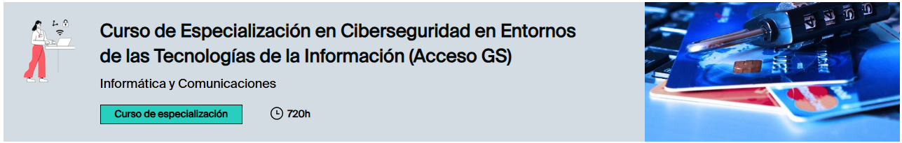

# Repositorio del Curso de Especialización en Ciberseguridad en Entornos de las Tecnologías de la Información (CETI)

Este repositorio contiene la documentación, prácticas y tareas realizadas durante el curso de especialización en ciberseguridad.

## Objetivo

Organizar y centralizar todos los contenidos desarrollados a lo largo de la formación, facilitando su consulta, reutilización y mejora continua.

## Contenido

En este repositorio encontrarás:

- 📄 Información del Modulo
- 📄 Apuntes y documentación técnica  
- 📄 Prácticas y ejercicios  
- 📁 Recursos adicionales  

## Asignaturas

Las materias incluidas en esta especialidad son:

- 🔐 [**Puesta en Producción Segura**](./Puesta-en-Produccion-Segura/)
- 🕵️ [**Análisis Forense Informático**](./Analisis-Forense-Informatico/)
- 📜 [**Normativa de Ciberseguridad**](./Normativa-de-Ciberseguridad/)
- 🛠️ [**Incidentes de Ciberseguridad**](./Incidentes-de-Ciberseguridad/)
- 🛡️ [**Bastionado de Redes y Sistemas**](./Bastionado-de-Redes-y-Sistemas/)
- 💻 [**Hacking Ético**](./Hacking-Etico/)

## Uso del repositorio

Puedes navegar por las carpetas para acceder a los contenidos organizados por asignatura. Cada sección incluye documentación y ejercicios relacionados.

## Información del Modulo

| FAMILIA PROFESIONAL | TIPO DE MODULO        | HORAS |
|---------------------|------------------------|-------|
| Informática y Comunicaciones | Curso de especialización | 720h |

## Requisitos de acceso

* [Título de Técnico Superior en Administración de Sistemas Informáticos en Red.](https://www.todofp.es/que-estudiar/familias-profesionales/informatica-comunicaciones/admin-sist-informaticos-red.html)
* [Título de Técnico Superior en Desarrollo de Aplicaciones Multiplataforma.](https://www.todofp.es/que-estudiar/familias-profesionales/informatica-comunicaciones/des-aplicaciones-multiplataforma.html)
* [Título de Técnico Superior en Desarrollo de Aplicaciones Web.](https://www.todofp.es/que-estudiar/familias-profesionales/informatica-comunicaciones/des-aplicaciones-web.html)
* [Título de Técnico Superior en Sistemas de Telecomunicaciones e Informáticos.](https://www.todofp.es/que-estudiar/familias-profesionales/electricidad-electronica/sistemas-telecomunicaciones-informaticos.html)
* [Título de Técnico Superior en Mantenimiento Electrónico.](https://www.todofp.es/que-estudiar/familias-profesionales/electricidad-electronica/mantenimiento-electronico.html)

* Si no tienes dicha titulación, pero hay disponibilidad de plazas y la administración competente lo contempla (hasta un máximo del 20 % de las plazas), puedes acceder si cumples uno de los siguientes requisitos:
  + 1º Si tienes un título de Técnico o Técnico Superior de Formación Profesional diferente de los que den acceso y acreditas experiencia en el área profesional asociada al curso.
  + 2º Si tienes un título de Técnico o Técnico Superior de Formación Profesional diferente de los que den acceso y acreditas conocimientos previos adecuados mediante una prueba de capacidad, una entrevista personal, una solicitud de motivación de ingreso, currículum, o experiencia laboral.
  + 3º Si no eres titulado/a en FP, pero puedes acreditar conocimientos previos que garanticen tu competencia para seguir con éxito el curso de especialización, mediante una prueba de capacidad, una entrevista personal, currículum, o experiencia laboral. Obtendrás una certificación académica de realización con aprovechamiento que sustituirá al título de Especialista (si el curso es de Grado Medio) o al de Máster de Formación Profesional (si el curso es de Grado Superior).

## Salidas profesionales

[Perfiles Profesionales](https://www.todofp.es/dam/jcr%3A5b719494-f6d7-4b35-a0c3-12109248ee51/curso-de-especializaci-n-en-ciberseguridad--ifc.pdf)

**Trabajar como:**

* Experto/a en ciberseguridad.
* Auditor/a de ciberseguridad.
* Consultor/a de ciberseguridad.
* Hacker ético.

Puedes trabajar en entidades de los sectores que necesiten establecer mecanismos y medidas para la protección de los sistemas de información y redes de comunicaciones.

## Qué voy a aprender

* Elaborar e implementar planes de prevención y concienciación en ciberseguridad en la organización, aplicando la normativa vigente.
* Diseñar planes de securización contemplando las mejores prácticas para el bastionado de sistemas y redes.
* Configurar sistemas de control de acceso y autenticación en sistemas informáticos, cumpliendo los requisitos de seguridad y minimizando las posibilidades de exposición a ataques.
* Diseñar y administrar sistemas informáticos en red y aplicar las políticas de seguridad establecidas, garantizando la funcionalidad requerida con un nivel de riesgo controlado.
* Implantar sistemas seguros de desplegado de software con la adecuada coordinación entre los desarrolladores y los responsables de la operación del software.

Consulta el resto de competencias en el [Real Decreto de establecimiento de este título](https://www.boe.es/diario_boe/txt.php?id=BOE-A-2020-4963 "Externo, se abre en ventana nueva.")

## Dónde estudiar

[Centros que imparten este ciclo](https://www.educacion.gob.es/centros/buscarCentros?ensenanzaFP=124_2001)

## Tus estudios en Europa

[Suplemento Europass Español](https://www.todofp.es/dam/jcr%3A766bd262-0bd5-47fc-9da1-2fc75f58fe2e/ce-gs-ciberseguridad-entornos-tecnologias-de-la-informacion.pdf)

[Suplemento Europass Inglés](https://www.todofp.es/dam/jcr%3A259e09a4-d6b6-484d-acbd-02a898590f49/ce-gs-ciberseguridad-entornos-tecnologias-de-la-informacion.pdf)

## Notas

Este repositorio es de carácter educativo y está en constante actualización.

---
